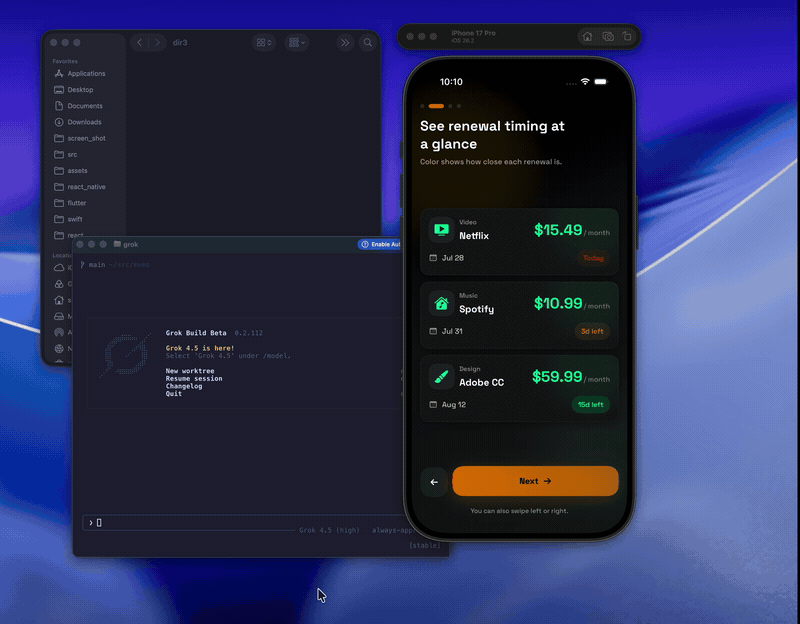

# CapMark

CapMark is a local-first macOS menu bar app for capturing, annotating, and
sharing screen regions without interrupting your workflow.

Your screenshots and annotations stay on your Mac. CapMark does not require an
account or upload your captures.



## Features

- Capture any rectangular screen region with a global keyboard shortcut
- Annotate captures with arrows, rectangles, highlights, freehand strokes,
  blackouts, and text
- Copy, save, or drag captures directly into another app
- Quickly return to recent captures from the Shelf and history
- Customize image format, file naming, save location, retention, and shortcuts
- Run quietly from the menu bar without a Dock icon

## Requirements

- macOS 14 Sonoma or later
- Screen Recording permission

## Install with Homebrew

```sh
brew install --cask shogoisaji/capmark/capmark
```

Homebrew installs CapMark in your Applications folder and keeps it up to date:

```sh
brew update
brew upgrade --cask capmark
```

## Install manually

Download the latest ZIP from
[GitHub Releases](https://github.com/shogoisaji/CapMark/releases), extract it,
and move `CapMark.app` to your Applications folder.

## Getting started

1. Open CapMark from your Applications folder.
2. Grant Screen Recording permission when prompted. If needed, open
   **System Settings → Privacy & Security → Screen & System Audio Recording**
   and enable CapMark, then restart the app.
3. Press **⇧⌘2** to start a capture.
4. Drag over the part of the screen you want to capture.
5. Use the Shelf to copy, save, drag, or annotate the captured image.

The capture shortcut and post-capture behavior can be changed from CapMark
settings.

## Uninstall

```sh
brew uninstall --cask capmark
```

To also remove settings and locally stored capture history:

```sh
brew uninstall --cask --zap capmark
```

## Privacy

CapMark processes captures locally. It does not upload screenshots, use cloud
processing, or require an account.

Capture history and settings are stored under:

```text
~/Library/Application Support/CapMark
```

## License

CapMark is open-source software licensed under the
[MIT License](LICENSE).
